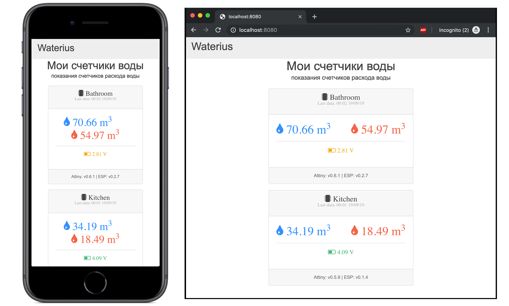

# httpwaterius

[](https://travis-ci.org/grffio/httpwaterius)

httpwaterius web сервер с простым UI, который отображает данные, полученные с устройств [waterius][waterius].



## Требования к системе

- [Docker][docker]
- [Docker Compose][dockercompose]
- Доменное имя и [DNS provider account][dnsapi]

## Ограничения

- Текущая версия приложения не умеет отправлять email с показаниями счетчиков
- Текущая версия приложения не имеет БД для хранения данных сенсоров, отображаются текущие полученные данные

## Установка

### С использованием Docker

```bash
docker pull grffio/httpwaterius
```

### Из исходников

```bash
go install ./...
```

## Конфигурация

Приложение настраивается с помощью переменных окружения.
Имена переменных должны начинаться с префикса `HTTPWATERIUS_`.
Посмотреть список всех поддерживаемых переменных можно с помощью команды:

```bash
httpwaterius -h
или
docker run --rm httpwaterius -h
```

Для правильной работы сервиса необходимо [настроить][setup] устройство waterius:

1) В поле `Уникальный ключ` указать идентификатор устройства (например, `Bathroom` или `Kitchen`).
2) В поле `Адрес сервера` указать адрес и порт httpwaterius (например, `http://IP:8080/data` или `https://ВАШ-ДОМЕН/data`).

В настройках httpwaterius необходимо перечислить ваши устройства (например, `HTTPWATERIUS_SERVICE_DEVICES="Bathroom,Kitchen"`).
Данные идентификаторы будут отображаться в UI (Имя уcтройства).

## Быстрый старт

### Без использования HTTPS и аутентификации

```bash
docker run -d --name httpwaterius -p 8080:8080/tcp \
            -e HTTPWATERIUS_SERVICE_DEVICES="Bathroom,Kitchen" grffio/httpwaterius
```

### Без использования HTTPS, с использованием аутентификации

```bash
docker run -d --name httpwaterius -p 8080:8080/tcp      \
            -e HTTPWATERIUS_SERVICE_DEVICES="Bathroom,Kitchen"  \
            -e HTTPWATERIUS_SERVICE_USERNAME="admin"    \
            -e HTTPWATERIUS_SERVICE_PASSWORD="P@ssw0rd" \
            grffio/httpwaterius
```

Перейдите на страницу `http://localhost:8080/` или `http://IP:8080/`

### Проверка

```bash
curl --insecure -X POST -H "Content-Type: application/json" -d '{"ch0":"1", "ch1":"2", "delta0":"1", "delta1":"1", "key":"Kitchen", "voltage":"4.99", "voltage_low":"false", "version":"v0.0.1", "version_esp":"v0.1.4"}' http://localhost:8080/data
```

### C использованием HTTPS (Let's Encrypt сертификат) и аутентификацией

В примере используется сервис [GoDaddy][godaddy] в качестве регистратора домена, для А записи указан IP сервера, на котором запускается приложение, список поддерживаемых провайдеров с [DNS API][dnsapi]. Перед началом работы перейдите в директорию `bootstrap`:

```bash
cd bootstrap
```

1) В файле `docker-compose.yml` - замените значения переменных окружения на ваши:
    - GD_Key=GODADDY_KEY
    - GD_Secret=GODADDY_SECRET
    - HTTPWATERIUS_SERVICE_USERNAME=admin
    - HTTPWATERIUS_SERVICE_PASSWORD=P@ssw0rd
    - HTTPWATERIUS_SERVICE_DEVICES=Bathroom,Kitchen
2) В файле `docker-compose.yml` - замените доменное имя с `example.com` на ваше (во всех вхождениях).

Запустите приложение:

```bash
docker-compose up -d
```

> На хостовой системе создется каталог `/opt/acmesh`, в котором расположены автоматически сгенерированные сертификаты.
> Сертификат будет автоматически обновляться, для того чтобы новый сертификат применился в приложении, его необходимо перезапустить: `docker-compose restart httpwaterius`

### C использованием HTTPS (Self-Signed сертификат) и аутентификацией

Перед началом работы перейдите в директорию `bootstrap`:

```bash
cd bootstrap
```

1) Сгенерируйте Self-Signed сертификат: `./gen-cert.sh`.
2) В память устройства waterius необходимо записать `server.crt`.
2) В файле `docker-compose.yml` - замените значения переменных окружения на ваши:
    - HTTPWATERIUS_SERVICE_USERNAME=admin
    - HTTPWATERIUS_SERVICE_PASSWORD=P@ssw0rd
    - HTTPWATERIUS_SERVICE_DEVICES=Bathroom,Kitchen

Запустите приложение:

```bash
docker-compose --file docker-compose-ss.yml up -d
```

---

TODO:

- Добавить возможность отправки email с данными счетчиков по расписанию
- Добавить запуск сервера на двух портах http\https , добавить redirect с http на https
- Добавить выпуск Let's Encrypt сертификата в приложение
- Добавить поддержку БД для хранения данных сенсоров
- Добавить провайдера аутентификации
- Добавить идентификацию устройств по автоматически сгенерированному ключу, привязать к email
- Переделать UI, добавить: графики, возможность переименовывания устройств, серийные номера к счетчикам, отображение favicon
- Разобраться с 'listen tcp :443: bind: permission denied' в контейнере с непривилегированным пользователем
- Разобраться с пробросом переменной VERSION как аргумента для docker build

## Лицензия
Исходный код данного проекта распространяется под лицензией MIT.

[dnsapi]: https://github.com/Neilpang/acme.sh/wiki/dnsapi
[docker]: https://docs.docker.com/install/
[dockercompose]: https://docs.docker.com/compose/install/
[godaddy]: https://ru.godaddy.com/
[setup]: https://github.com/dontsovcmc/waterius/blob/master/Setup.md
[waterius]: https://github.com/dontsovcmc/waterius
